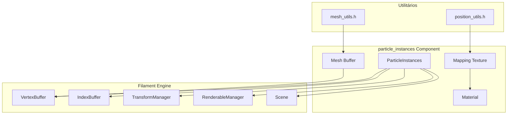
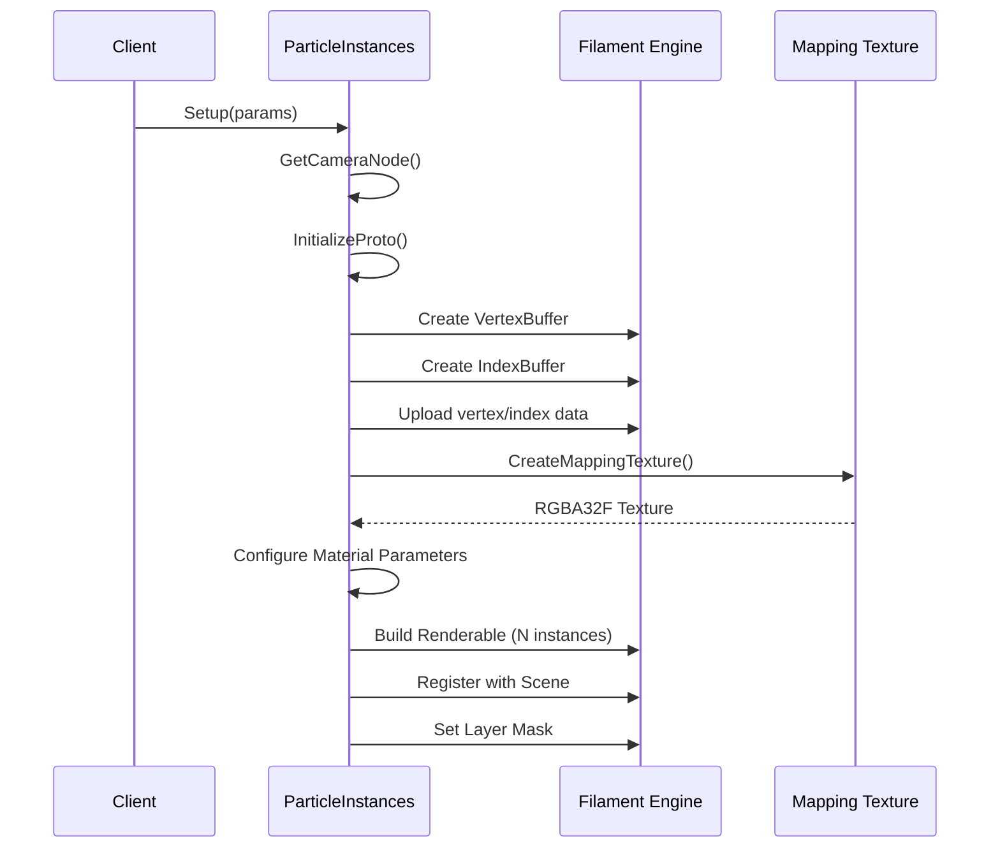
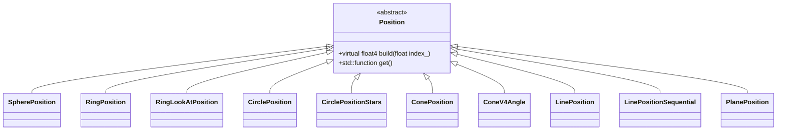
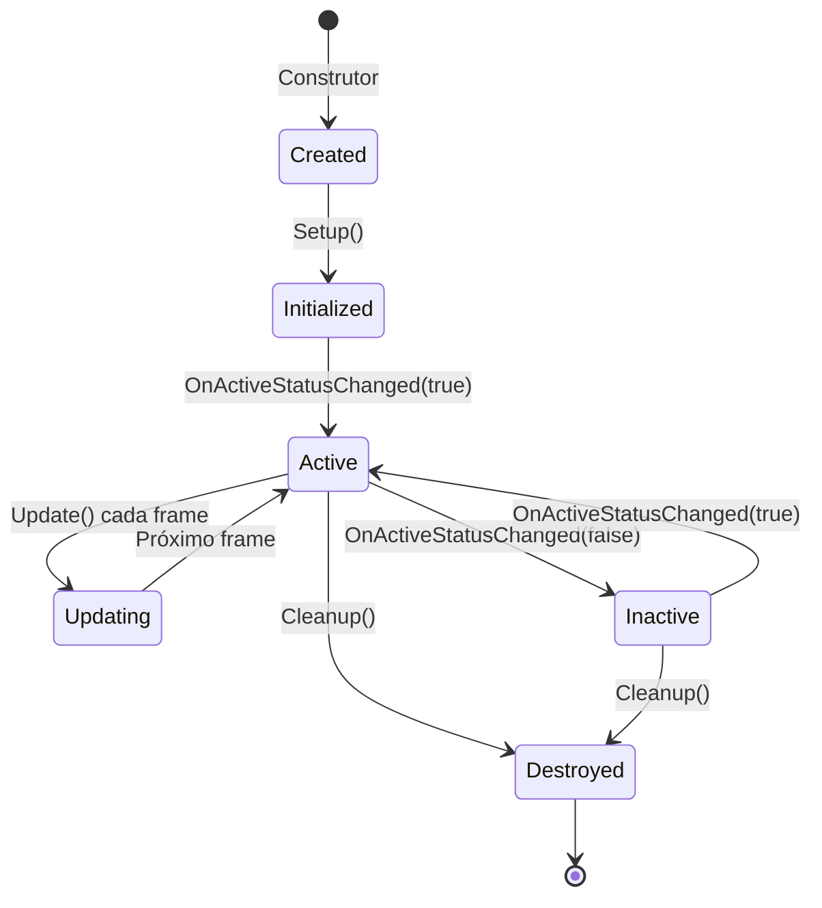
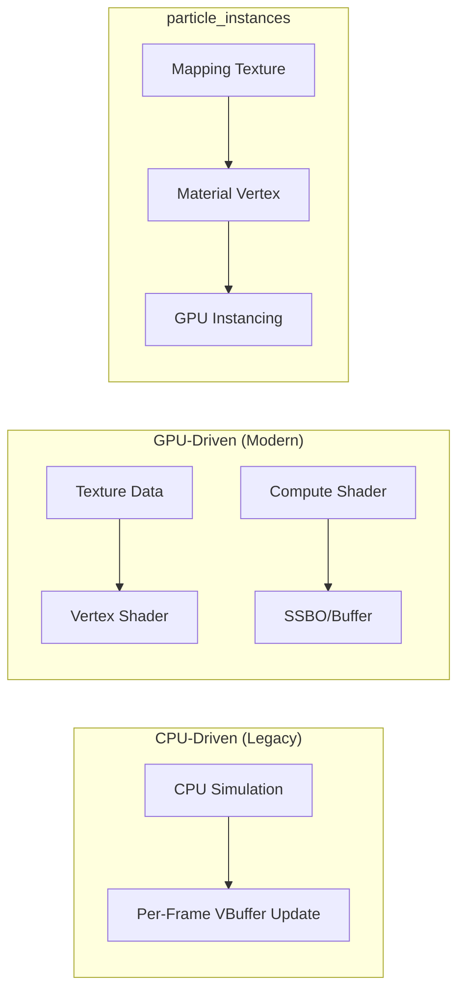
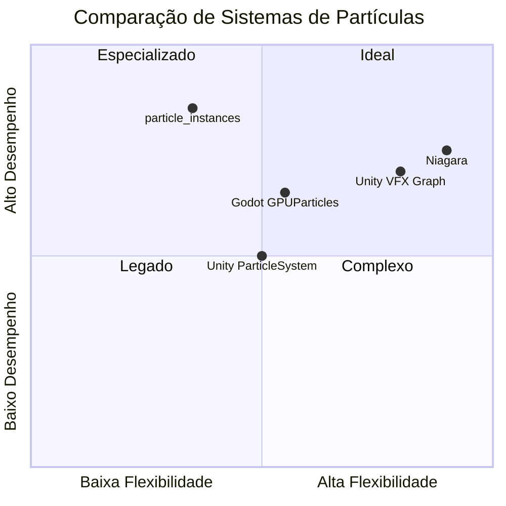

# Documentação Técnica: particle_instances

## Visão Geral

O componente `particle_instances` é um sistema de renderização de partículas otimizado que utiliza **GPU instancing** através do engine Filament. Este componente permite criar efeitos visuais com milhares de partículas sem impacto significativo no desempenho, aproveitando a capacidade da GPU de renderizar múltiplas instâncias de um mesmo mesh em uma única draw call.

---

## Arquitetura



### Dependências

| Dependência | Descrição |
|-------------|-----------|
| `@com_google_impress//:api` | Framework IMP para componentes |
| `particle_instances_assets` | Assets compilados (materiais) |
| `particle_instances_state_cc_imp` | Protobuf para estado do componente |
| Filament Engine | Motor gráfico para renderização |

---

## Estrutura de Arquivos

| Arquivo | Descrição |
|---------|-----------|
| [particle_instances.h](file:///home/lucas.lima/Documents/Projects/OpenGL-Render/Instances/components/particle_instances/particle_instances.h) | Declaração da classe principal |
| [particle_instances.cc](file:///home/lucas.lima/Documents/Projects/OpenGL-Render/Instances/components/particle_instances/particle_instances.cc) | Implementação do componente |
| [position_utils.h](file:///home/lucas.lima/Documents/Projects/OpenGL-Render/Instances/components/particle_instances/position_utils.h) | Classes para distribuição espacial de partículas |
| [mesh_utils.h](file:///home/lucas.lima/Documents/Projects/OpenGL-Render/Instances/components/particle_instances/mesh_utils.h) | Definições de meshes primitivos |
| [BUILD.bazel](file:///home/lucas.lima/Documents/Projects/OpenGL-Render/Instances/components/particle_instances/BUILD.bazel) | Build rules do Bazel |
| [example.mat](file:///home/lucas.lima/Documents/Projects/OpenGL-Render/Instances/components/particle_instances/data/example.mat) | Material de exemplo com vertex shader |

---

## Classes Principais

### ParticleInstances

Classe principal que encapsula o sistema de partículas instanciadas.

#### Membros Privados

| Membro | Tipo | Descrição |
|--------|------|-----------|
| `camera_node_` | `NodeHandle` | Handle do nó da câmera para cálculos de orientação |
| `app` | `App` | Container dos recursos Filament (buffers, materiais) |
| `entity_` | `utils::Entity` | Entidade Filament para a cena |
| `material` | `MaterialPtr` | Ponteiro para o material das partículas |
| `particles_amount` | `int` | Quantidade total de partículas |
| `texture_width` | `int` | Dimensão da textura de mapeamento |
| `layer_mask_` | `int` | Máscara de camada para visibilidade |
| `positionFunction` | `Function4f` | Função para calcular posições iniciais |
| `info_` | `EntityInfo` | Informações de transformação |
| `state_` | `ParticleInstancesState` | Estado serializado via Protobuf |

#### Métodos Públicos

| Método | Assinatura | Descrição |
|--------|------------|-----------|
| `Setup` | `void Setup()` | Inicialização vazia (requerida por proto) |
| `Setup` | `void Setup(ParticleInstancesParams&)` | Inicializa com parâmetros completos |
| `Update` | `void Update(const FrameTime&)` | Atualização por frame |
| `Cleanup` | `void Cleanup()` | Liberação de recursos |
| `GetInstance` | `RenderableManager::Instance GetInstance() const` | Retorna instância do renderable |
| `OnActiveStatusChanged` | `void OnActiveStatusChanged(bool)` | Callback de ativação/desativação |
| `CreateMappingTexture` | `Texture* CreateMappingTexture()` | Cria textura de posicionamento |
| `SetTransform` | `void SetTransform(EntityInfo)` | Aplica transformação à entidade |
| `InitializeProto` | `void InitializeProto()` | Inicializa estado do protobuf |
| `OnIsfStateChanged` | `void OnIsfStateChanged()` | Callback de mudança de estado ISF |

---

### Estruturas de Dados

#### App

Container para recursos Filament gerenciados pelo componente.

```cpp
struct App {
    filament::VertexBuffer* vb;        // Buffer de vértices
    filament::IndexBuffer* ib;         // Buffer de índices
    filament::MaterialInstance* matInstance; // Instância do material
    filament::TransformManager* tm;    // Gerenciador de transformações
    utils::Entity renderable;          // Entidade renderizável
};
```

#### EntityInfo

Informações de transformação para a entidade.

```cpp
struct EntityInfo {
    float3 position;                   // Posição no espaço 3D
    float3 scale = float3(1.0, 1.0, 1.0); // Escala (padrão: 1.0)
    float3 rotation;                   // Rotação em graus (Euler)
};
```

#### ParticleInstancesParams

Parâmetros de configuração para o sistema de partículas.

```cpp
struct ParticleInstancesParams {
    EntityInfo info;          // Transformação inicial
    int amount;               // Número de partículas
    float3 position;          // Posição adicional
    float3 rotation;          // Rotação adicional
    float3 color;             // Cor das partículas
    float2 size;              // Tamanho (min, max)
    float radius;             // Raio de distribuição
    int angle;                // Ângulo de emissão
    bool center;              // Centralizar posições
    float2 velocity;          // Velocidade (min, max)
    MaterialPtr material;     // Material personalizado
    TexturePtr texture;       // Textura das partículas
    MeshInfo* mesh;           // Mesh a ser instanciado
    Function4f positionFunction; // Função de posicionamento
};
```

---

## Fluxo de Inicialização

O método `Setup(ParticleInstancesParams&)` executa a seguinte sequência:



---

## Textura de Mapeamento

A textura de mapeamento é um **RGBA32F texture** que armazena dados de posicionamento por partícula. Cada pixel representa uma partícula:

| Canal | Uso |
|-------|-----|
| R | Coordenada X normalizada [0,1] |
| G | Coordenada Y normalizada [0,1] |
| B | Coordenada Z normalizada [0,1] |
| A | Ângulo de rotação ou dados extras |

### Cálculo de Dimensão

```cpp
texture_width = ceil(sqrt(particles_amount))
```

O tamanho da textura é calculado como a raiz quadrada do número de partículas, garantindo uma textura quadrada que acomoda todas as partículas.

---

## Sistema de Posicionamento (position_utils.h)

O arquivo fornece classes abstratas para distribuição espacial das partículas:

### Hierarquia de Classes



### Formatos de Distribuição

| Classe | Descrição | Parâmetros |
|--------|-----------|------------|
| `SpherePosition` | Distribuição esférica uniforme | `radius`, `radial_range`, `angular_range` |
| `RingPosition` | Anel cilíndrico 3D | `radius`, `ring_thickness` |
| `RingLookAtPosition` | Anel com orientação para centro | `radius`, `ring_thickness` |
| `CirclePosition` | Disco 2D no plano XZ | `radius` |
| `CirclePositionStars` | Disco 2D no plano XY | `radius`, `radial_limit` |
| `ConePosition` | Cone 3D | `min_radius`, `max_radius` |
| `ConeV4Angle` | Cone com ângulo configurável | `min_radius`, `max_radius`, `height`, `angle` |
| `LinePosition` | Linha aleatória 1D | `size` |
| `LinePositionSequential` | Linha sequencial | - |
| `PlanePosition` | Plano 2D | `size` |

### Exemplo de Uso

```cpp
auto spherePos = SpherePosition(1.0f, float2(0.0, 1.0), float2(0.0, 1.0));
params.positionFunction = spherePos.get();
```

---

## Sistema de Meshes (mesh_utils.h)

Fornece meshes primitivos prontos para instanciamento.

### Interface Base

```cpp
class MeshInfo {
public:
    virtual int GetVerticesAmount() const = 0;
    virtual int GetIndexesAmount() const = 0;
    virtual Vertex* GetVertices() const = 0;
    virtual uint16_t* GetIndexes() const = 0;
};
```

### Meshes Disponíveis

| Classe | Vértices | Índices | Descrição |
|--------|----------|---------|-----------|
| `MeshSphere` | 62 | 360 | Esfera UV |
| `MeshIcoSphere` | 12 | 60 | Icosaedro |
| `MeshCube` | 8 | 36 | Cubo básico |
| `MeshCubeFixed` | 36 | 36 | Cubo com normais fixas |
| `MeshPyramid` | 18 | 18 | Pirâmide |
| `MeshPlane` | 4 | 6 | Plano simples |
| `MeshQuad` | 4 | 6 | Quad para billboards |
| + outros | ... | ... | ... |

---

## Sistema de Materiais

Os materiais utilizam o formato `.mat` do Filament com suporte a instancing.

### Parâmetros Obrigatórios

| Parâmetro | Tipo | Descrição |
|-----------|------|-----------|
| `Tex` | `sampler2D` | Textura de mapeamento de posições |
| `TextureWidth` | `int` | Largura da textura de mapeamento |
| `Amount` | `int` | Número total de partículas |

### Parâmetros Opcionais

| Parâmetro | Tipo | Descrição |
|-----------|------|-----------|
| `Texture` | `sampler2D` | Textura das partículas |
| `Velocity` | `float2` | Velocidade de animação |
| `Angle` | `int` | Ângulo de emissão |
| `Size` | `float2` | Tamanho das partículas |
| `Radius` | `float` | Raio de distribuição |
| `Position` | `float3` | Offset de posição |
| `Rotation` | `float3` | Rotação base |
| `Color` | `float3` | Cor base |
| `Center` | `bool` | Centralização |
| `CameraPosition` | `float3` | Posição relativa da câmera (atualizado no Update) |

### Exemplo de Material

```glsl
material {
    name : "ParticleExample",
    instanced : true,  // OBRIGATÓRIO para instancing
    culling : none,
    requires : [ uv0, color ]
}

vertex {
    void materialVertex(inout MaterialVertexInputs material) {
        // Acessar dados via getInstanceIndex()
        highp float3 position = getPosition().xyz;
        int idx = getInstanceIndex();
        // ... aplicar transformação baseada em idx
    }
}
```

---

## Ciclo de Vida



### Atualização por Frame

O método `Update()` é chamado a cada frame e atualiza a posição da câmera no material:

```cpp
void ParticleInstances::Update(const FrameTime &frame_time) {
    material->TrySetParameter("CameraPosition", 
        camera_node_->GetWorldPosition() - info_.position);
}
```

Isso permite efeitos como billboarding ou orientação de partículas em direção à câmera.

---

## Sistema de Transformação

A transformação final é composta por:

```cpp
transform = Translation × Scale × (RotZ × RotY × RotX)
```

A rotação utiliza ângulos de Euler com ordem **ZYX** (primeiro aplica X, depois Y, depois Z).

### Conversão Graus→Radianos

```cpp
float rotationX = info.rotation.x * (M_PI / 180.0f);
float rotationY = info.rotation.y * (M_PI / 180.0f);
float rotationZ = info.rotation.z * (M_PI / 180.0f);
```

---

## Integração com ISF (Interactive State Framework)

O componente suporta sincronização de estado via Protobuf + ISF:

- `InitializeProto()`: Inicializa valores padrão do estado
- `OnIsfStateChanged()`: Callback quando estado muda externamente
- `state_`: Objeto `ParticleInstancesState` serializável

Isso permite animações e transições controladas externamente.

---

## Considerações de Desempenho

| Aspecto | Recomendação |
|---------|--------------|
| **Quantidade de partículas** | Limite prático ~10K-50K dependendo do hardware |
| **Tamanho de mesh** | Usar meshes simples (4-12 vértices) |
| **Draw calls** | Sistema usa 1 draw call para todas as partículas |
| **Textura de mapeamento** | RGBA32F é 16 bytes/partícula |
| **Overdraw** | Configurar `culling: none` apenas se necessário |

---

## Exemplo de Uso Completo

```cpp
// 1. Criar parâmetros de configuração
ParticleInstancesParams params;
params.amount = 1000;
params.info.position = float3(0.0f, 5.0f, 0.0f);
params.info.scale = float3(0.1f, 0.1f, 0.1f);

// 2. Definir distribuição espacial
auto spherePos = SpherePosition(5.0f, float2(0.0, 1.0), float2(0.0, 1.0));
params.positionFunction = spherePos.get();

// 3. Definir mesh das partículas
static MeshQuad quadMesh;
params.mesh = &quadMesh;

// 4. Configurar material
params.material = LoadMaterial("particle_material");
params.texture = LoadTexture("particle_sprite.png");
params.color = float3(1.0f, 0.8f, 0.2f);
params.size = float2(0.5f, 1.0f);
params.velocity = float2(0.5f, 2.0f);

// 5. Inicializar componente
ParticleInstances particles;
particles.Setup(params);
```

---

## Limitações Conhecidas

1. **Bounding box zerada**: O renderable é criado com `boundingBox({{ 0, 0, 0 }, { 0, 0, 0 }})`, desabilitando frustum culling
2. **Memory leak potencial**: A textura de mapeamento usa `delete[]` com cast incorreto (`uint32_t*` ao invés de `float*`)
3. **Sem animação de spawn/despawn**: Partículas são estáticas após criação
4. **Posições calculadas uma vez**: A `positionFunction` é chamada apenas no setup

---

## Análise Comparativa com Sistemas de Mercado e Literatura Acadêmica

### Fundamentos Acadêmicos

O conceito de sistemas de partículas foi introduzido por **William Reeves** no artigo seminal *"Particle Systems—A Technique for Modeling a Class of Fuzzy Objects"* (SIGGRAPH 1983). O trabalho original definia partículas como primitivas que:

- São geradas, movem-se, mudam e "morrem" ao longo do tempo
- Utilizam processos estocásticos para geração e controle
- Possuem atributos individuais (cor, transparência, tamanho)

O `particle_instances` implementa uma variação moderna deste conceito, substituindo a simulação temporal por **posicionamento estático via textura**, otimizado para GPU.

### Comparativo com Game Engines



#### Unity Engine

| Aspecto | Unity Particle System | Unity VFX Graph | particle_instances |
|---------|----------------------|-----------------|-------------------|
| **Arquitetura** | CPU simulation + GPU render | Node-based GPU compute | Texture-based instancing |
| **Data Storage** | CPU arrays | Compute buffers | RGBA32F Texture |
| **Instancing** | Opcional (mesh mode) | Automático por batch | Built-in via Filament |
| **Simulação** | Por frame (CPU/GPU) | Por frame (GPU) | Setup-time only |
| **Spawn/Despawn** | ✅ Dinâmico | ✅ Dinâmico | ❌ Estático |
| **Colisão** | ✅ CPU/GPU | ✅ GPU | ❌ Não suportado |
| **Editor Visual** | ✅ Inspector | ✅ Node Graph | ❌ Código apenas |
| **Mobile** | ⚠️ Limitado | ⚠️ Limitado | ✅ Otimizado |

**Similaridades com Unity:**
- Ambos usam GPU instancing para mesh particles
- Material customizável controla aparência
- Suporte a textura atlas para variação

**Diferenças:**
- Unity simula partículas cada frame; `particle_instances` é estático
- Unity tem editor visual; este sistema requer código

---

#### Unreal Engine (Niagara)

| Aspecto | Niagara | particle_instances |
|---------|---------|-------------------|
| **Arquitetura** | Modular ECS-like on GPU | Component-based |
| **Draw Method** | Indirect Drawing | Hardware Instancing |
| **Data Storage** | GPU Buffers + Attributes | RGBA32F Texture |
| **Simulação** | ✅ GPU Compute | ❌ Pré-calculado |
| **Customização** | Scratch Pad + Modules | Material + Position Classes |
| **Bounds** | Dinâmico/Fixo | Fixo (zerado) |
| **Performance** | ~50-100+ partículas supera Cascade | Otimizado para milhares |

**Similaridades com Niagara:**
- Ambos favorecem processamento na GPU
- Modularidade (Niagara modules ≈ Position classes)
- Suporte a meshes customizados

**Diferenças:**
- Niagara usa *indirect drawing* (GPU emite draw commands)
- Niagara suporta simulação física completa
- Este sistema tem overhead zero de simulação

---

#### Godot Engine

| Aspecto | Godot GPUParticles3D | particle_instances |
|---------|---------------------|-------------------|
| **Shader** | Compute-like process shader | Vertex shader |
| **Customização** | ParticleProcessMaterial | Filament .mat |
| **Instancing** | Transform feedback style | Hardware instancing |
| **Complexidade** | Média | Baixa |

---

### Comparativo de Técnicas Acadêmicas

| Técnica | Descrição | Usado em particle_instances |
|---------|-----------|:---------------------------:|
| **Texture-based Data** | Armazena dados de partícula em texels | ✅ RGBA32F texture |
| **Hardware Instancing** | GPU desenha N cópias de mesh com 1 draw call | ✅ `.instances(N)` |
| **Billboarding** | Quads sempre orientados à câmera | ⚠️ Via material |
| **Compute Shaders** | Simulação paralela massiva | ❌ Não utilizado |
| **Transform Feedback** | GPU escreve posições de volta para buffer | ❌ Não utilizado |
| **Indirect Drawing** | GPU emite seus próprios draw calls | ❌ Não utilizado |
| **Point Sprites** | Partículas como pontos expandidos | ❌ Usa mesh |

---

### Análise de Trade-offs



#### Vantagens do particle_instances

| Vantagem | Justificativa |
|----------|---------------|
| **Desempenho excepcional** | Zero overhead de simulação runtime |
| **Baixo consumo de memória** | Apenas 16 bytes/partícula na textura |
| **Complexidade reduzida** | Sem sistemas de física ou colisão |
| **Mobile-first** | Otimizado para Filament/Android |
| **Determinístico** | Mesmo resultado visual sempre |
| **Integração ISF** | Estado sincronizado externamente |

#### Desvantagens vs. Concorrentes

| Limitação | Impacto | Alternativas de Mercado |
|-----------|---------|------------------------|
| Sem simulação dinâmica | Não serve para fumaça/fluidos | Unity VFX, Niagara |
| Sem spawn/despawn | Quantidade fixa | Todos os sistemas modernos |
| Sem editor visual | Requer conhecimento de código | Unity/Unreal/Godot |
| Sem colisão | Partículas atravessam geometria | Niagara GPU Collision |
| Posições não-animadas | Efeitos estáticos apenas | Compute Shaders |

---

### Casos de Uso Recomendados

| Cenário | particle_instances | Alternativa Recomendada |
|---------|:------------------:|------------------------|
| Estrelas no céu | ✅ Ideal | - |
| Foliage instancing | ✅ Ideal | - |
| Partículas de ambiente estáticas | ✅ Ideal | - |
| Fogo/fumaça | ❌ | Unity VFX, Niagara |
| Explosões | ❌ | Unity VFX, Niagara |
| Fluidos | ❌ | Compute Shaders |
| Física de partículas | ❌ | Niagara |

---

### Referências Acadêmicas

1. **Reeves, W.T.** (1983). *"Particle Systems—A Technique for Modeling a Class of Fuzzy Objects"*. SIGGRAPH '83.
2. **Latta, L.** (2004). *"Building a Million Particle System"*. Game Developers Conference.
3. **Kipfer, P., Segal, M., Westermann, R.** (2004). *"UberFlow: A GPU-Based Particle Engine"*. Graphics Hardware.
4. **Kolb, A., Latta, L., Rezk-Salama, C.** (2004). *"Hardware-based Simulation and Collision Detection for Large Particle Systems"*. Graphics Hardware.

---

## Referências

- [Filament Rendering Engine](https://google.github.io/filament/)
- [GPU Instancing Best Practices](https://developer.nvidia.com/gpugems/gpugems2/part-ii-shading-lighting-and-shadows/chapter-15-instancing)
- [Unity VFX Graph Documentation](https://docs.unity3d.com/Packages/com.unity.visualeffectgraph@latest)
- [Unreal Niagara Documentation](https://docs.unrealengine.com/en-US/RenderingAndGraphics/Niagara/)
- [Godot GPUParticles3D](https://docs.godotengine.org/en/stable/classes/class_gpuparticles3d.html)

